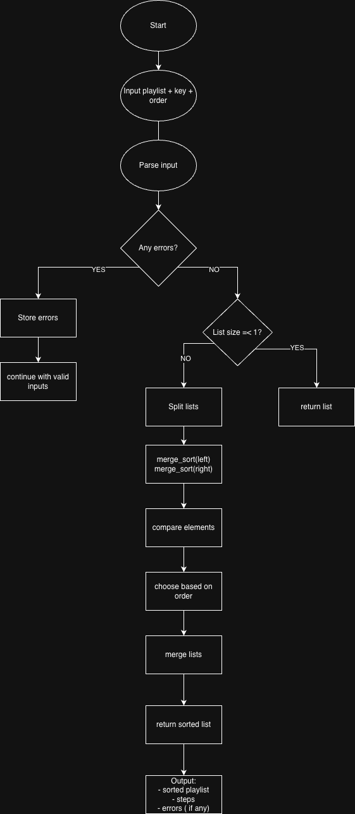
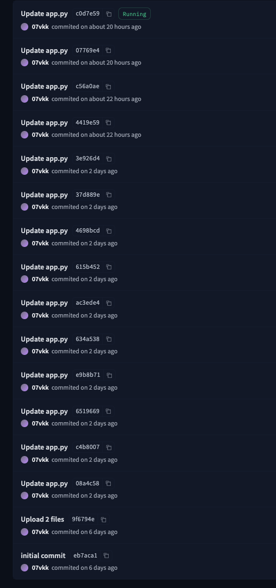

# CISC-121 Project – Poppy-Playlist-Visualiser

## Chosen Problem
This project solves the Playlist Vibe Builder problem by sorting songs by energy, duration, title, or artist. It helps a user organize a playlist depending on the mood or pacing they want.

## Chosen Algorithm
I chose Merge Sort for this project. It is a good fit because it is efficient, works well on lists of records, and its divide-and-merge process is easy to visualize step by step for a user learning how sorting works. The playlist data contains multiple songs, and each song has several components such as titles, artists, energy, and duration. Merge Sort works well because it can sort these song records using a selected key while keeping the structure of each song together. It also makes the sorting process clear because the list is repeatedly split into smaller parts and then merged back in sorted order.

## Preconditions and Assumptions
- Each song must have a title, artist, energy value, and duration.
- Energy must be a whole number from 0 to 100.
- Duration must be a positive whole number.
- The app checks for invalid input and shows an error message if the format is incorrect.
- Multiple artists are allowed; they will follow alphabetical order of the first listed artist.
- A quiz feature was added to test the user’s understanding of the selected sorting rule. For example, if the order is ascending, the quiz helps the user check what the correct order should be.
  
## What the User Sees During the Simulation
The user sees:
- the original playlist input,
- the final sorted playlist,
- the Merge sort steps, including splitting, comparisons, selections, and merged sections
- the step log highlights the splits, comparisons and placements so that the user can follow each stage of the algorithm.
This helps the user understand what the algorithm is doing instead of only seeing the final result.

## Demo
[Watch Demo Video](cisc-example-video.mov)

## Problem Breakdown & Computational Thinking

### Decomposition
- Read and validate the playlist input
- Convert each line into a song record
- Split the playlist into smaller sublists
- Compare songs using the selected sorting key
- Merge the smaller sorted lists back together
- Display the sorted playlist and all sorting steps
  
### Pattern Recognition
The same comparison process repeats throughout the algorithm. Merge Sort keeps splitting the list, then repeatedly compares the front elements of two smaller sorted lists until the full list is rebuilt in order.

### Abstraction
The app shows the most important parts of the sorting process, such as splitting, comparing, and merging songs. It hides lower-level details like memory handling and Python internals because they are not necessary for the user to understand how the algorithm works.

### Algorithm Design
Input → user enters playlist data and chooses a sorting key
Process → the program validates the data, runs Merge Sort, and records each step
Output → the app displays the sorted playlist and a step-by-step explanation of the sorting process. A quiz is also provided.

## Flowchart

## Steps to run locally
 1. Make sure Python is installed on your system.
 2. Install required dependencies:
   pip install -r requirements.txt
 3. Run the application:
   python app.py
 4. Open the local Gradio link shown in the terminal.
 5. Enter a playlist and start sorting.

## Hugging Face Link
[Open the live app](https://huggingface.co/spaces/07vkk/Poppy-Playlist-Visualiser)

The GitHub repository contains the same final `app.py` used in the deployed Hugging Face app.

## Testing

The application was tested using normal cases, edge cases, invalid inputs, and user interface actions to verify correctness, robustness, and usability. Testing was completed on the final working version of the app, and all tests passed successfully.

This chart was generated with AI to make the README cleaner on GitHub, but all tests were completed before it was added.

### Testing Goals
The testing process was designed to confirm that:
- the custom Merge Sort algorithm produced correct results
- the application handled both ascending and descending order correctly
- all supported sorting keys worked properly
- invalid input was detected and reported clearly
- the interface features behaved as expected
- the app remained stable without crashing

### Normal Sorting Tests
The following standard sorting scenarios were tested:

| Test Case | Input / Action | Expected Result | Actual Result | Outcome |
|---|---|---|---|---|
| Sort by energy ascending | Valid playlist with multiple songs | Songs sorted from lowest to highest energy | Correctly sorted | Pass |
| Sort by energy descending | Valid playlist with multiple songs | Songs sorted from highest to lowest energy | Correctly sorted | Pass |
| Sort by duration ascending | Valid playlist with multiple songs | Songs sorted from shortest to longest duration | Correctly sorted | Pass |
| Sort by duration descending | Valid playlist with multiple songs | Songs sorted from longest to shortest duration | Correctly sorted | Pass |
| Sort by title ascending | Valid playlist with multiple songs | Songs sorted alphabetically by title | Correctly sorted | Pass |
| Sort by title descending | Valid playlist with multiple songs | Songs sorted in reverse alphabetical order by title | Correctly sorted | Pass |
| Sort by artist ascending | Valid playlist with multiple songs | Songs sorted alphabetically by artist | Correctly sorted | Pass |
| Sort by artist descending | Valid playlist with multiple songs | Songs sorted in reverse alphabetical order by artist | Correctly sorted | Pass |

### Edge Case Tests
The application was also tested with special cases to make sure it behaved correctly under less common conditions.

| Test Case | Input / Action | Expected Result | Actual Result | Outcome |
|---|---|---|---|---|
| Single-song playlist | One valid song only | Playlist remains unchanged and app still runs correctly | Returned unchanged | Pass |
| Two-song playlist | Two valid songs | Songs sorted correctly and quiz still functions | Correctly sorted | Pass |
| Equal energy values | Multiple songs sharing the same energy value | Songs still sorted consistently | Worked correctly | Pass |
| Boundary energy values | Songs with energy values 0 and 100 | Boundary values handled correctly | Correctly sorted | Pass |
| Very short and very long durations | Songs with duration values such as 1 and 999 | Duration sorting still correct | Correctly sorted | Pass |
| Mixed capitalization | Titles/artists using upper and lower case letters | Sorting remains case-insensitive for text fields | Worked correctly | Pass |
| Blank lines between songs | Valid songs with empty lines in input | Blank lines ignored and valid songs still processed | Worked correctly | Pass |

### Input Validation and Error Handling Tests
Invalid input was tested to confirm that the app displayed helpful messages and did not crash.

| Test Case | Example Input / Action | Expected Result | Actual Result | Outcome |
|---|---|---|---|---|
| Missing title | `\| The Weeknd \| 90 \| 200` | Error message for missing title | Correct error shown | Pass |
| Missing artist | `Blinding Lights \| \| 90 \| 200` | Error message for missing artist | Correct error shown | Pass |
| Missing separators | `Blinding Lights The Weeknd 90 200` | Format error shown | Correct error shown | Pass |
| Too few fields | `Blinding Lights \| The Weeknd \| 90` | Format error shown | Correct error shown | Pass |
| Non-numeric energy | `Blinding Lights \| The Weeknd \| high \| 200` | Error message for invalid energy | Correct error shown | Pass |
| Non-numeric duration | `Blinding Lights \| The Weeknd \| 90 \| long` | Error message for invalid duration | Correct error shown | Pass |
| Energy below range | `Blinding Lights \| The Weeknd \| -5 \| 200` | Error message for out-of-range energy | Correct error shown | Pass |
| Energy above range | `Blinding Lights \| The Weeknd \| 120 \| 200` | Error message for out-of-range energy | Correct error shown | Pass |
| Zero duration | `Blinding Lights \| The Weeknd \| 90 \| 0` | Error message for invalid duration | Correct error shown | Pass |
| Negative duration | `Blinding Lights \| The Weeknd \| 90 \| -10` | Error message for invalid duration | Correct error shown | Pass |

### User Interface Tests
The Gradio interface was tested to ensure that the app was interactive and easy to use.

| Test Case | Action | Expected Result | Actual Result | Outcome |
|---|---|---|---|---|
| Random Example button | Click button | A valid sample playlist appears in the input box | Worked correctly | Pass |
| Start Live Sort button | Click button with valid input | Sorting simulation begins and outputs update | Worked correctly | Pass |
| Guided Example button | Click button | Guided explanation appears step by step | Worked correctly | Pass |
| Reset button | Click button | All visible outputs are cleared | Worked correctly | Pass |
| Speed slider | Adjust slider during sorting | Sorting animation speed changes | Worked correctly | Pass |
| Sorting Steps accordion | Open accordion | Step-by-step Merge Sort log is visible | Worked correctly | Pass |
| Input Errors accordion | Open accordion after invalid input | Error messages are visible | Worked correctly | Pass |
| Interface clarity | Review labels/instructions | Labels are understandable and beginner-friendly | Worked correctly | Pass |

### Quiz Feature Tests
The quiz feature was tested to make sure it supported learning and responded correctly.

| Test Case | Action | Expected Result | Actual Result | Outcome |
|---|---|---|---|---|
| Quiz generation | Start sorting with at least two songs | Quiz question appears | Worked correctly | Pass |
| Yes button | Click when correct answer is Yes | Correct feedback shown | Worked correctly | Pass |
| No button | Click when correct answer is No | Correct feedback shown | Worked correctly | Pass |
| Not enough songs for quiz | Start with fewer than two songs | Quiz reports insufficient data | Worked correctly | Pass |

### Summary of Results
All tested cases passed. Valid playlists were sorted correctly using the custom Merge Sort implementation, including all supported sorting keys and both sorting orders. Edge cases were handled properly, invalid input produced clear error messages, and the GUI features behaved as expected. The app remained stable during testing and did not crash.

## Author & Acknowledgment
I, Victor Korotash, created this Hugging Face app with the help of ChatGPT. I used ChatGPT as a support tool for brainstorming, debugging, and improving explanations when I got stuck. All final decisions, testing, and submitted content were reviewed by me before inclusion in the project. Some of the ideas I had on my own, and some were suggested by the AI. For example, I wanted there to be a song bank, and ChatGPT helped implement a randomizer so the same songs do not repeat.
